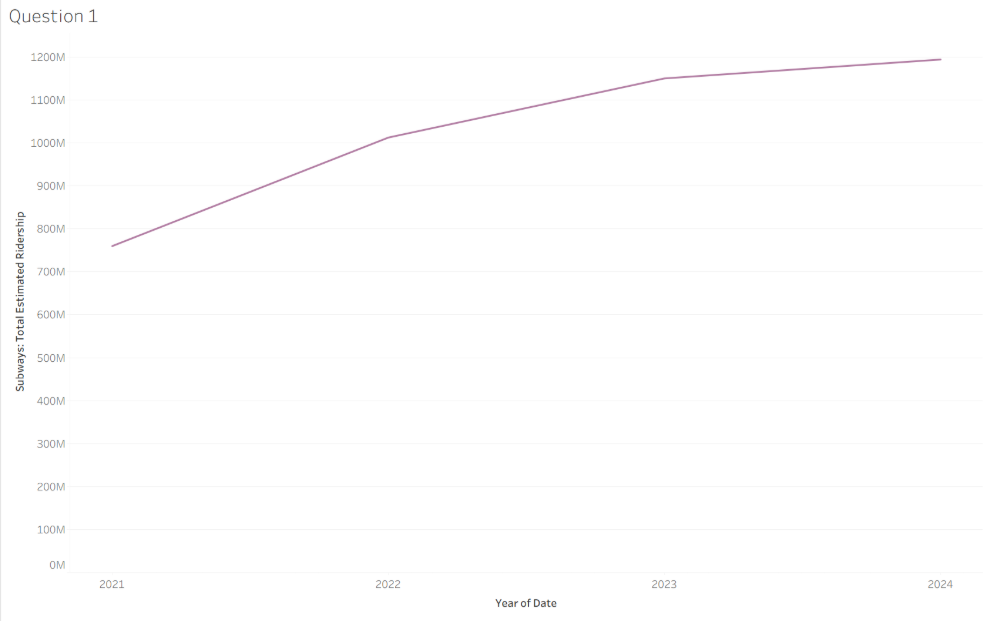
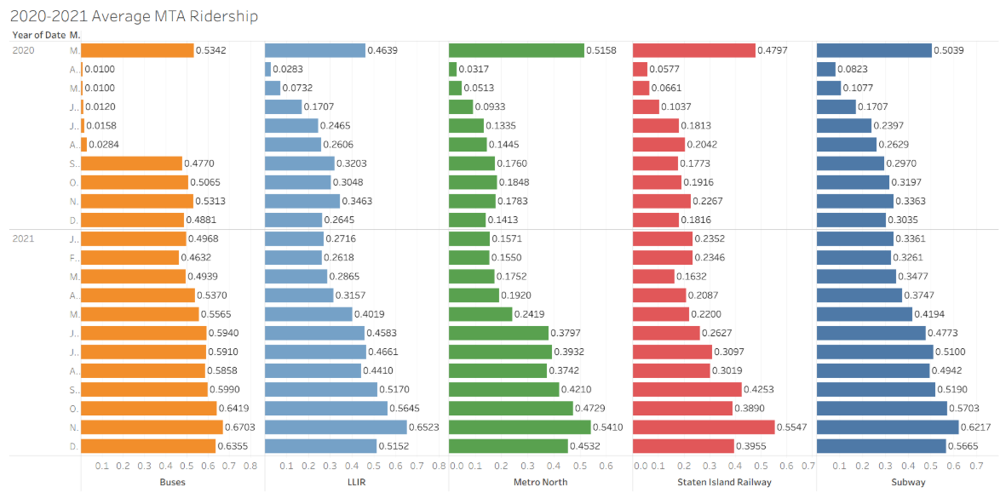
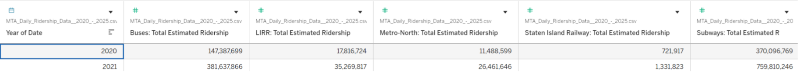

# 4610 Group Project 2 
Team F25MIST4610_59925_Group6
# Group Members 
1. Sulema Gonzalez [@sulemagonzalez90](https://github.com/sulemagonzalez90)
2. Iris Huang [@ih1024](https://github.com/ih1024)
3. Abby Simmavanh [@asmmi27](https://github.com/asmmi27)
4. Julia Tardy [@jutardy32](https://github.com/jutardy32)
5. Jay Tran  [@TeaQuoffee](https://github.com/TeaQuoffee)
# Our Dataset and What it Contains
The dataset we have chosen is [MTA Daily Ridership Data: 2020-2025](https://catalog.data.gov/dataset/mta-daily-ridership-data-beginning-2020) . This data was published by the Metropolitan Transportation Authority (MTA) of New York. The dataset contains information on systemwide daily ridership and traffic estimates across multiple modes of transportation (railways, buses, bridges, and tunnels). The collection of data begins January 1st 2020, while also providing data from the pre-pandemic date for comparison. The collection continues into December 31st 2024 with 1776 days worth of data. The MTA tracks the usage of transportation and traffic patterns to show changes pre-pandemic, during the pandemic, and post-pandemic. 

- There are 1,776 rows, each row corresponds to: a single day 
- There are 15 columns, each column represents a piece of information: 
1. date
2. subways: total estimated ridership
3. subways: % of comparable pre-pandemic day
4. buses: total estimated ridership
5. buses: % of comparable pre-pandemic day
6. LIRR: total estimated ridership
7. LIRR: % of comparable pre-pandemic day
8. metro-north: total estimated ridership
9. metro-north: % of comparable pre-pandemic day
10. access-a-ride: total scheduled trips
11. access-a-ride: % of comparable pre-pandemic day
12. bridges and tunnels: total traffic
13. bridges and tunnels: % of comparable pre-pandemic day
14. staten island railway: total estimated ridership
15. staten island railway: % of comparable pre-pandemic day
# 2 Questions and Why? 
Question 1: How did daily subway ridership change from 2021 to 2024?
- Why is this question important and interesting? The subway system is a frequent traffic mode of transportation by New Yorkers. As a result, the change in ridership of the subway would be the best indicator of how citizens' commuting to work, shopping, etc. has improved and New York City is recovering from the pandemic. The results of this question can help city officials, transportation coordinators, and other government officials understand the length of a recovery if a major event were to happen like this again and the habits New York City citizens practice and how they can appeal to them such as what times of the year citizens use transportation more.

Question 2: Which MTA transportation mode recovered fastest compared to pre-pandemic levels?
- Why is this question important and interesting? This question encapsulates the multiple transportation services. Through the view of all transportation modes one may not how each was affected by the pandemic and how they recovered. The patterns in recovery also reveal which modes of transportation commuters may have chose to take after the pandemic versus pre-pandemic. Seeing the results of every mode helps the MTA adjust scheduling, funding, and investing based on the speed of recovery. 

# Manipulations Applied to the Dataset 
1) Include Year Ranges from 2021 and 2024
- 2020: At the start of COVID, a majority of New Yorkers were forced to work from home while the MTA was operating at regular capacity, so only essential workers were still using the MTA for their commutes, resulting in lower than normal passenger counts for the year
- 2025: The data for 2025 is still incomplete, resulting in a lower total passenger count for the year.

2) Excluding Modes of Transportation (Cars and Trucks, Tolls and Roads), and Years 2022-2025
- Access-A-Ride (AAR): Data from AAR comes from scheduled rides made by riders with disabilities that make them unable to ride other modes of public transportation, this will disproportionately skew data about the general public.
- Bridges and Tunnels: Cars, trucks, and other modes of transportation are counted by vehicle that pass through the toll roads and bridges managed by the MTA and do not accurately count the amount of passengers that utilize them, and have no restrictions placed upon them by the COVID lockdown, which will also skew data on MTA ridership recovery.

# Analysis and Results
1) In 2021, the total estimated ridership was around 750 million people. Since after COVID, ridership levels for subways have been increasing steadily and is sitting close to 1200 million as of the end of 2024; however, it has yet to reach pre-pandemic ridership levels
- Takeaway: Total estimated Subway riders remain below pre-pandemic levels but have began to increase. While there are many reasons for this a few we want to highlight for this would be due to advancements in ride share apps taking away subway riders, less riders during the pandemic led to less revenue and in turn less improvements to the subway system. Additionally, there is less commuters! Due to the pandemic many roles were able to switch to hybrid roles or fully remote and have yet to transition back to strictly in person. With more people at home there are less commuters riding the subway. 
2) Explanatory analysis helps us understand why the patterns we observed in the descriptive analysis occurred
  
Original hypothesis: We expected transportation modes used by essential workers to recover faster, compared to commuter-rail systems that serve office workers

Through our data, we found that:
-Buses recovered the fastest because essential workers continued in-person travel earlier and relied heavily on bus service
-Subways and LIRR had steady growth as both essential riders and office workers slowly returned under hybrid work arrangements
-Staten Island Railway recovered slowly due to its smaller rider base and more localized travel patterns
-Metro-North modes had the weakest recovery because remote work reduced the amount of traditional commuter travel
Revised hypothesis: the recovery patterns can also be understood by the average trip distance and the types of trips each mode supports.
-Buses recovered the fastest because they serve short, local trips that are able to rebound quickly after disruptions.
-Subways and the LIRR showed steady growth as medium-distance travel gradually returned.
-Staten Island Railway recovered slowly due to its smaller user base and moderate, localized patterns. 
-Metro-North had the weakest recovery because it serves long-distance commuter trips, which were the slowest in return. 

# Tableau Packaged Workbook 
 

